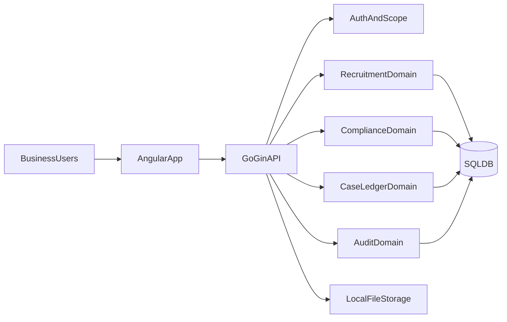

# Integrated Platform Architecture Plan

## Scope And Assumptions
- Target stack: Angular frontend, Go (Gin) backend, SQL database, offline intranet deployment.
- Source requirements: `prompt.md`, `metadata.json`, and ambiguity clarifications in `questions.md`.

## 1) Architecture
- Use modular monolith backend with clear bounded contexts and shared infrastructure modules.
- Use Angular feature modules by domain (auth, recruitment, compliance, case ledger, audit) plus shared UI/core modules.
- Enforce RBAC + data-scope checks at API middleware and domain service layers (defense in depth).
- Keep file upload/import/export on local filesystem abstraction with SHA256 dedup and resumable chunks.

## 2) Module Breakdown
- Frontend modules: `auth`, `dashboard`, `recruitment`, `compliance`, `case-ledger`, `audit-log`, `admin-rbac`, `shared`, `core`.
- Backend modules: `identity`, `authorization`, `recruitment`, `compliance`, `caseledger`, `attachments`, `auditlog`, `search-scoring`, `notifications`, `infrastructure`.
- Shared backend packages: `errors`, `validation`, `crypto`, `middleware`, `repository`, `clock/idgen`.

## 3) Module Boundaries
- Domain modules expose service interfaces; only infrastructure layer touches SQL/filesystem directly.
- `authorization` owns permission + data-scope policy checks; other modules consume it via interface contracts.
- `auditlog` is append-only and invoked by domain modules through event-style write API.
- `attachments` module owns file whitelist checks, chunk assembly, SHA256 dedup, and metadata index.
- Data-scope clarification: each client/supplier record is institution-owned (`institutionId`), and cross-institution access is denied by policy.

## 4) Domain Model And Contracts
- Core aggregates: User, Role, DataScope, Candidate, Position, QualificationProfile, RestrictionRule, Case, Attachment, AuditRecord.
- Contract-first REST APIs (OpenAPI):
  - Auth/session: login/logout/refresh (8h TTL, invalidation on logout).
  - Recruitment: bulk import, candidate merge (phone/ID collision), search + score explanation.
  - Compliance: qualification lifecycle, expiry reminder, auto-deactivation, purchase restriction checks.
  - Case ledger: numbering, anti-duplication window, assignment, processing history, attachments.
  - Audit: query/export append-only records with before/after deltas.
- Field protection contract: sensitive fields encrypted at rest and masked in list endpoints.
- Clarifications from `questions.md`:
  - Auto-deactivation is enforced by check-on-arrival logic (on login and regulated actions).
  - "Once per 7 days" is a strict rolling 168-hour window.
  - Delete operations are soft deletes for regulated entities; hard delete is disallowed.
  - Explainable match scoring baseline: skills (50), experience (30), education (20).

## 5) Failure Handling
- Unified error model (`code`, `message`, `details`, `traceId`) across APIs.
- Retry-safe idempotency for high-risk writes (case submissions, bulk imports, chunk uploads).
- Time-window duplicate guards (5-minute case dedupe) with DB+cache compatible strategy.
- Graceful degradation for scoring/recommendation failures: return base search results with explicit warning flag.
- Expiration reliability in offline mode: perform qualification expiry checks during user/session flow and sensitive transactions.

## 6) Docker Requirements
- Multi-service Compose profile for intranet deployment:
  - `frontend` (Angular static server)
  - `api` (Go/Gin)
  - `db` (SQL)
  - `migration` job
- Volumes for attachments/temp chunks/audit exports; explicit backup/restore docs.
- Environment-driven config (`.env`): bcrypt cost, token TTL, expiry threshold (default 30 days), upload limits, whitelist MIME types.
- Health checks: API readiness/liveness + DB connectivity + writable storage path checks.

## 7) Logging And Validation
- Structured JSON logs with `traceId`, `userId`, `role`, `scope`, `action`, `entity`, `status`, latency, source IP.
- Separate security audit stream for permission changes and sensitive-field edits.
- Validation layers:
  - Transport: request shape/required fields/range constraints.
  - Domain: business invariants (purchase interval, required prescription attachment, numbering rules).
  - Persistence: unique keys/check constraints for anti-dup and integrity.
- Non-repudiation policy: audit log records remain append-only and non-modifiable, including before/after deltas.

## 8) Verification Strategy
- Define acceptance criteria per requirement in `prompt.md` and map to test IDs.
- Add contract tests for every public API path and auth/scope permutation.
- Run pre-release verification matrix: role-based views, scope isolation, expiry automation, dedupe behavior, masking/encryption checks.
- Include intranet/offline operational checks (startup with no external network dependencies).

## 9) Testing Depth And Practical Coverage >= 90% (Where Applicable)
- Backend goals:
  - >=90% line coverage for domain services, validation, authorization, numbering, dedupe, restriction logic, and masking/encryption adapters.
  - Contract/integration tests for critical API flows and failure paths.
- Frontend goals:
  - >=90% coverage for business logic in services/guards/interceptors and complex form validators.
  - Component tests for critical workflows (import, merge resolution, qualification expiry handling, case submission guardrails).
- Practical coverage policy:
  - Focus 90% on high-risk modules; allow lower coverage for generated code/wiring/simple DTOs with explicit exclusions.
  - Gate CI on per-module thresholds plus mutation-style checks for critical rule engines when feasible.

## Delivery Sequence
1. Define contracts and domain boundaries.
2. Implement auth/scope + shared validation/error/logging base.
3. Implement recruitment/compliance/case modules with audit hooks.
4. Add attachments/chunk upload/dedup + import/export.
5. Harden with failure-mode tests and coverage gates.
6. Package with Docker and intranet deployment verification checklist.

## Ambiguity Closure Checklist

The following items must be treated as normative implementation constraints.

### Decision Register
- **AMB-01 ClientScopeOwnership**
  - Rule: client/supplier data is institution-owned and isolated.
  - API impact: every read/write enforces scope by institution/department/team.
  - Verification: deny cross-institution access attempts.
- **AMB-02 ExpiryCheckOnArrival**
  - Rule: expiry enforcement occurs during login and regulated operations.
  - API impact: qualification status may transition during request handling.
  - Verification: expired profile is auto-inactivated before transaction completion.
- **AMB-03 PurchaseWindow168h**
  - Rule: restriction policy uses strict rolling 168-hour window.
  - API impact: response includes `nextEligibleAt` when denied.
  - Verification: purchases before 168h are denied, after 168h allowed.
- **AMB-04 SoftDeleteOnly**
  - Rule: regulated entities are soft-deleted; hard delete disallowed.
  - API impact: delete endpoints map to state flags and audit append.
  - Verification: records are hidden from active views but remain queryable by audit.
- **AMB-05 ExplainableScorePolicy**
  - Rule: score baseline is skills 50, experience 30, education 20 with reasons.
  - API impact: search includes score plus human-readable reasons array.
  - Verification: deterministic score output and explanation consistency tests.
- **AMB-06 UtcClockAuthority**
  - Rule: policy windows use server-authoritative UTC time.
  - API impact: all timestamps are persisted in UTC.
  - Verification: same request yields same decision across branch locales.
- **AMB-07 DstNeutralDuration**
  - Rule: 7-day restriction uses elapsed seconds (168h), not calendar boundaries.
  - API impact: DST shifts do not change decision thresholds.
  - Verification: DST transition tests produce stable allow/deny outcomes.
- **AMB-08 ReactivationWorkflow**
  - Rule: reactivation occurs only after validation + approval workflow completion.
  - API impact: status transitions `inactive -> active` are workflow-gated.
  - Verification: partial renewal data cannot reactivate qualification.
- **AMB-09 MergeConflictPrecedence**
  - Rule: primary record wins by default with explicit field override rules.
  - API impact: merge response and audit include field-level override outcomes.
  - Verification: conflicting fields resolve deterministically across reruns.
- **AMB-10 CaseSerialConcurrency**
  - Rule: case serial allocation is atomic per institution per day.
  - API impact: creation flow retries on contention without duplicate case number.
  - Verification: concurrent create load yields unique case numbers.